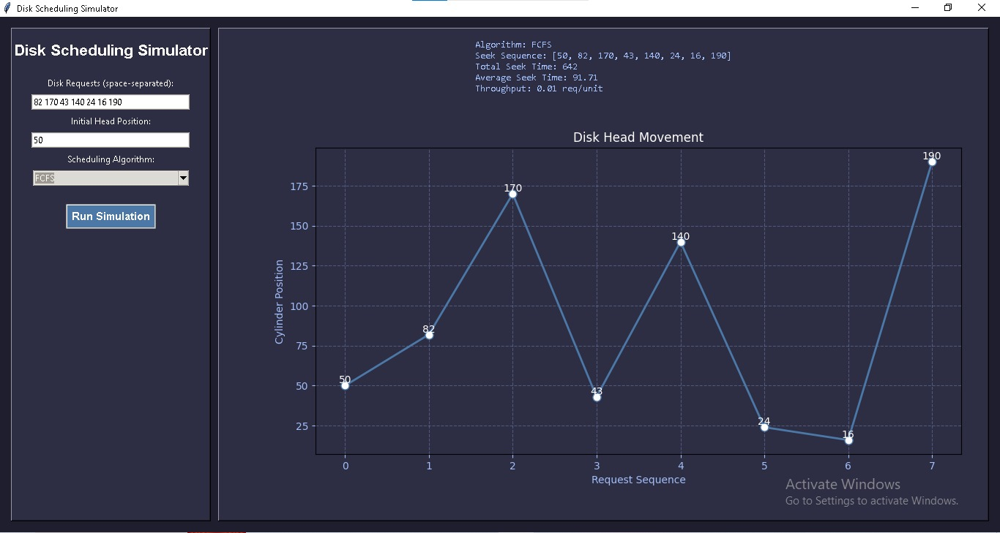

# 💽 Advanced Disk Scheduling Simulator

This is a Python-based simulator to visualize how various disk scheduling algorithms work. It supports algorithms like FCFS, SSTF, SCAN, and C-SCAN. Users can input disk access requests, choose the initial disk head position, and visualize how the head moves across the disk tracks.

---

## 📌 Features

- ✅ Selectable Disk Scheduling Algorithms:
  - FCFS (First Come First Serve)
  - SSTF (Shortest Seek Time First)
  - SCAN (Elevator Algorithm)
  - C-SCAN (Circular SCAN)

- ✅ User Input:
  - Custom disk requests (space-separated)
  - Initial disk head position

- ✅ Visualization:
  - Disk head movement plotted using matplotlib
  - Seek time calculation

- ✅ Performance Metrics:
  - Total Seek Time
  - Average Seek Time
  - Number of movements (throughput)

---

## 🖥️ GUI Demo

> Powered by **Tkinter** and **Matplotlib**

- User-friendly GUI to input values
- Drop-down to select algorithm
- Click "Simulate" to see graph & metrics

---

## 📊 Example

### Input:
Initial head position: 50
Disk requests: 82 170 43 140 24 16 190


### Output (FCFS):
- Head movement: 50 → 82 → 170 → 43 → 140 → 24 → 16 → 190
- Total Seek Time: 642
- Average Seek Time: 91.71

## 🖼️ GUI Preview




---

## 🛠️ Tech Stack

| Tool         | Purpose                      |
|--------------|------------------------------|
| Python       | Core programming             |
| Tkinter      | GUI Framework                |
| Matplotlib   | Visualization of movement    |
| Git + GitHub | Version control & collaboration |

---

## 🚀 How to Run

1. Clone the repo:
```bash
git clone https://github.com/Bishal13102003/disk-scheduling-simulator.git
